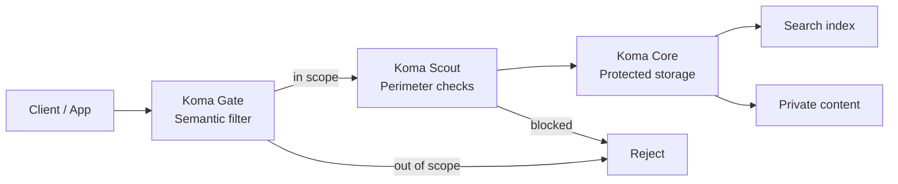

# Koma

### A prompt-injection firewall for Node.js.

Stop malicious prompts before they reach your LLM, tools, or RAG pipeline.

```bash
npm install koma-gate
```

<p align="center">
  
</p>

<p align="center">
  
  
  <a href="https://www.npmjs.com/package/koma-gate"></a>
  <a href="https://www.npmjs.com/package/koma-scout"></a>
  <a href="https://www.npmjs.com/package/koma-core"></a>
  <br />
  
  
</p>

<p align="center">
  <a href="./README.zh-CN.md">中文版</a>
</p>

<p align="center">
  
</p>

> *Security primitives distilled from a real AI application.* — [How Koma was built](https://dev.to/swnotmetal/the-3-production-failures-every-ai-app-hits-and-the-fix-i-extracted-5cl1)

---

### What It Stops

| Your app | Attack | Fix | Install |
|---|---|---|---|
| AI chatbot | Prompt injection / jailbreak | Semantic filter blocks attacks before the model | `koma-gate` |
| Voice AI | Audio abuse / flooding | Validation + rate limiting + geo | `koma-scout` |
| RAG / search | Data enumeration / scraping | Split index from content, token-gate retrieval | `koma-core` |

---

### Benchmarks

We threw **1,769 real prompt-injection attacks** at Koma Gate in fail-closed mode, using real providers — not mock adapters.

| Provider | Recall | Precision | False Positives |
|----------|:------:|:---------:|:---:|
| DeepSeek (deepseek-chat) | **98.8%** | **100%** | **0** |
| Google (gemini-2.5-flash) | 96.2% | **100%** | **0** |

**Chinese attack set**: 100% recall · 100% precision · 0% FPR across 8 categories.

> **Can you break it?** [Open an issue](https://github.com/swnotmetal/Project-Koma/issues) with an attack Koma misses. → [Full methodology](./BENCHMARKS.md)

---

### Quick Start

```ts
import { createGeneralKnowledgeGuard } from 'koma-gate';

const guard = createGeneralKnowledgeGuard({
  llm: { apiKey: process.env.GEMINI_API_KEY },
});

app.post('/api/chat', guard.middleware(), async (req, res) => {
  // Only in-scope requests reach your model
  res.json({ reply: await chat(req.body.message) });
});
```

```bash
git clone https://github.com/swnotmetal/Project-Koma
cd Project-Koma && node demo/server.js
curl http://localhost:8080/self-test
```

---

### Three Defenses

**`koma-gate`** — Prompt injection firewall. LLM-based scope classifier that blocks jailbreaks, off-topic requests, and instruction overrides. Supports OpenAI, Anthropic, Google, DeepSeek, and local Ollama models. [README →](./packages/koma-gate/README.md)

**`koma-scout`** — Perimeter protection. Rate limiting, audio upload validation, geo allowlisting. Cheap checks before expensive AI work. [README →](./packages/koma-scout/README.md)

**`koma-core`** — Protected RAG storage. Public search index, private content, opaque HKDF-derived tokens. [README →](./packages/koma-core/README.md)

Each package works standalone. Stack them: Gate filters → Scout throttles → Core stores.

---

### Using an AI coding agent?

Tell it:

> *"Add Koma to protect this AI endpoint. Use koma-gate for prompt injection, koma-scout for perimeter abuse, and koma-core for protected RAG retrieval. Each works standalone."*

Koma is designed for both human and agent discoverability. See [llms.txt](./llms.txt).

---

### Architecture



---

### Trust & Safety

- **Zero runtime dependencies.** No supply-chain surface.
- **No code execution.** Classifies, rate-limits, stores — never executes AI output.
- **Fail-closed by default.** A broken guard blocks, not passes.
- **CodeQL on every push.** Targets OWASP LLM01.
- **MIT licensed.**

→ [Security policy](./SECURITY.md) · [Known limitations](./SECURITY-HARDENING.md) · [Comparison with alternatives](./COMPARISON.md) · [Contributing](./CONTRIBUTING.md)

---

Koma comes from Komainu ("狛犬"), the stone guardian lions of Japanese Shinto shrines. Three defense layers. Each standalone. Patterns distilled from production, not papers.

[中文版](./README.zh-CN.md) · [License](./LICENSE)
