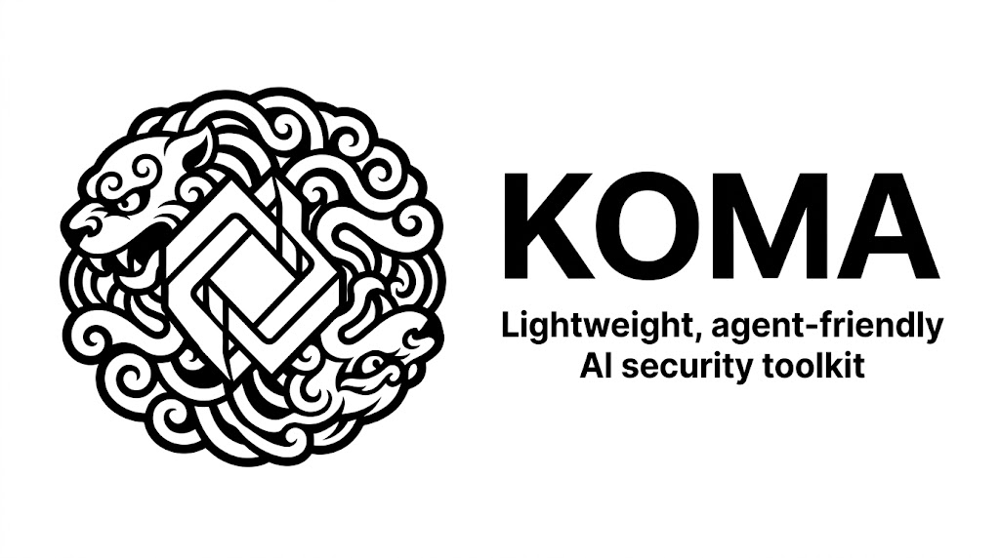
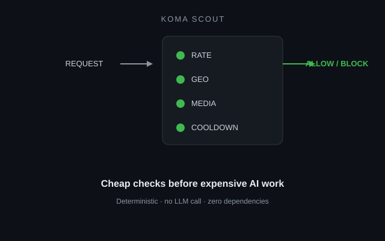
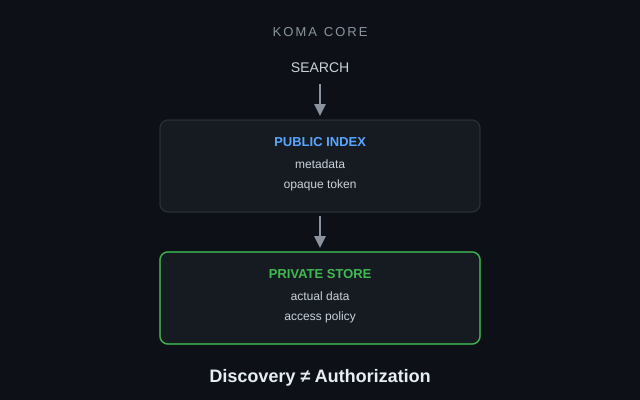

# Koma

### A prompt-injection firewall for Node.js.

Stop malicious prompts before they reach your LLM, tools, or RAG pipeline.

```bash
npm install koma-gate
```

<p align="center">
  
</p>

<p align="center">
  
  
  <a href="https://www.npmjs.com/package/koma-gate"></a>
  <a href="https://www.npmjs.com/package/koma-scout"></a>
  <a href="https://www.npmjs.com/package/koma-core"></a>
  <br />
  
  
  
  <a href="https://koma-demo.swbuilds.workers.dev"></a>
  <a href="https://glama.ai/mcp/servers/swnotmetal/Project-Koma"></a>
</p>

<p align="center">
  <a href="./README.zh-CN.md">中文版</a>
</p>

<p align="center">
  <strong>▶ <a href="https://koma-demo.swbuilds.workers.dev">Try the live demo</a></strong> — Gate, Scout &amp; Core in one page, no signup.
</p>

---

### What It Stops

| Your app | Attack | Fix | Install |
|---|---|---|---|
| AI chatbot | Prompt injection / jailbreak | Semantic filter blocks attacks before the model | `koma-gate` |
| Voice AI | Audio abuse / flooding | Validation + rate limiting + geo | `koma-scout` |
| RAG / search | Data enumeration / scraping | Split index from content, token-gate retrieval | `koma-core` |
| AI coding agent | Skill omission / compliance drift | Verify preparation, actions, and completion evidence | `koma-miko` *(source alpha)* |

Different attacks cross different boundaries. Koma provides a small primitive for each one.

---

### What Koma Is — and Isn't

**Is**: composable security primitives · defense-in-depth · usable independently · sits outside the model's authority · An engineering quick solution rooted from real production environment

**Isn't**: a model · an agent framework · a replacement for authorization · a magic prompt-injection detector · a complete security boundary by itself · "Use one LLM to guard another"

---

### Benchmarks

I threw **1,769 real prompt-injection attacks** at Koma Gate in fail-closed mode, using real providers — not mock adapters.

| Provider | Recall | Precision | False Positives |
|----------|:------:|:---------:|:---:|
| DeepSeek (deepseek-chat) | **98.8%** | **100%** | **0** |
| Google (gemini-2.5-flash) | 96.2% | **100%** | **0** |

**Chinese attack set**: 100% recall · 100% precision · 0% FPR across 8 categories.

> **Can you break it?** [Open an issue](https://github.com/swnotmetal/Project-Koma/issues) with an attack Koma misses. → [Full methodology](./BENCHMARKS.md)

---

### Quick Start

```ts
import { createGeneralKnowledgeGuard } from 'koma-gate';

const guard = createGeneralKnowledgeGuard({
  llm: { apiKey: process.env.GEMINI_API_KEY },
});

app.post('/api/chat', guard.middleware(), async (req, res) => {
  // Only in-scope requests reach your model
  res.json({ reply: await chat(req.body.message) });
});
```

```bash
git clone https://github.com/swnotmetal/Project-Koma
cd Project-Koma && node demo/server.js
curl http://localhost:8080/self-test
```

---

### Three Defenses

**`koma-gate`** — Prompt injection firewall. LLM-based scope classifier that blocks jailbreaks, off-topic requests, and instruction overrides. Supports OpenAI, Anthropic, Google, DeepSeek, and local Ollama models. [README →](./packages/koma-gate/README.md)


**`koma-scout`** — Perimeter protection. Rate limiting, audio upload validation, geo allowlisting. Cheap checks before expensive AI work. [README →](./packages/koma-scout/README.md)



**`koma-core`** — Protected RAG storage. Public search index, private content, opaque HKDF-derived tokens. *Discovery is not authorization.* [README →](./packages/koma-core/README.md)



Each package works standalone. Stack them: Gate filters → Scout throttles → Core stores.

**Experimental: `koma-miko` source alpha** — verifies that an agent loaded the
required skill, stayed within its action contract, and produced completion evidence
such as tests or rendered UI review. It is deterministic, has 19 alpha tests, and
is deliberately not published to npm yet. [README →](./packages/koma-miko/README.md) ·
[research and design →](./docs/design/miko.md)

**MCP servers** — expose Koma to AI agents directly:

- `koma-gate-mcp` — `classify_input` tool for prompt-injection checks. [README →](./packages/koma-gate-mcp/README.md)
- `koma-core-mcp` — `search_docs` + `retrieve_doc` for protected RAG retrieval. [README →](./packages/koma-core-mcp/README.md)

```json
{
  "mcpServers": {
    "koma-gate": { "command": "npx", "args": ["-y", "koma-gate-mcp"] },
    "koma-core": { "command": "npx", "args": ["-y", "koma-core-mcp"] }
  }
}
```

---

### Using an AI coding agent?

Tell it:

> *"Add Koma to protect this AI endpoint. Use koma-gate for prompt injection, koma-scout for perimeter abuse, and koma-core for protected RAG retrieval. Each works standalone."*

Koma is designed for both human and agent discoverability — including two [MCP servers](./packages/koma-gate-mcp/README.md). See [llms.txt](./llms.txt).

---

### Trust & Safety

- **Minimal dependency surface.** Gate and Core have no third-party runtime dependencies; Scout declares Express as a peer.
- **No code execution.** Classifies, rate-limits, stores — never executes AI output.
- **Fail-open by default.** A broken optional guard does not take down the app; security-first deployments can set `failOpen: false`.
- **CodeQL on every push.** Targets OWASP LLM01.
- **MIT licensed.**

→ [Security policy](./SECURITY.md) · [Known limitations](./SECURITY-HARDENING.md) · [Comparison with alternatives](./COMPARISON.md) · [Contributing](./CONTRIBUTING.md)

---

Koma comes from Komainu ("狛犬"), the stone guardian lions of Japanese Shinto shrines. Three deployed defense layers, each standalone, plus the experimental Miko agent-contract boundary. Patterns distilled from production, not papers.

[License](./LICENSE)
