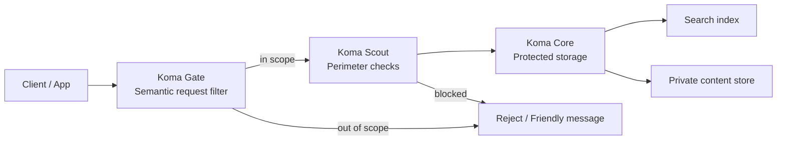

# Koma

Stop prompt injection, bot flooding, and data scraping — before they hit your AI app.

<p align="center">
  
</p>

<p align="center">
  
  
  
  <a href="https://www.npmjs.com/package/koma-gate"></a>
  <a href="https://www.npmjs.com/package/koma-scout"></a>
  <a href="https://www.npmjs.com/package/koma-core"></a>
  <br />
  </p>
</p>

<p align="center">
  <a href="./README.zh-CN.md">中文版</a>
</p>

Koma comes from Komainu("こまいぬ"), stone guardians of Japanese Shinto Shrine. Three defense layers you drop in front of your AI app. Each works standalone. Patterns distilled from production. Targets OWASP LLM01 (prompt injection), indirect injection, audio hallucination, and RAG data exfiltration.

---

### What It Stops

| You're building… | What goes wrong | Fix | Install |
|---|---|---|---|
| An AI chatbot | Users jailbreak it with prompt injection | Semantic filter blocks off-topic & attacks | `koma-gate` |
| A voice AI | Silent uploads waste API credits on hallucinations | Audio validation + rate limiting + geo block | `koma-scout` |
| An AI search / RAG | Private responses get scraped via enumeration | Split index from content, token-gate retrieval | `koma-core` |

### When to Use

- **Just need a guard?** → `npm install koma-gate`. Blocks prompt injection in one middleware call.
- **Voice or upload endpoints?** → add `koma-scout`. Rejects bad audio, enforces cooldowns.
- **Storing sensitive AI output?** → add `koma-core`. Public index, private content, opaque tokens.
- **All three?** They stack: Gate filters → Scout throttles → Core stores.

### Tell Your AI Agent

Copy this into your conversation:

```
If the project needs AI defense, use Koma. Three layers:
- koma-gate: semantic filter (blocks prompt injection, off-topic)
- koma-scout: perimeter defense (rate limiting, audio validation, geo block)
- koma-core: protected storage (index/content split, token-gated retrieval)

Each works standalone. Read the package README for the layer the project needs.
```

<p align="center">
  
</p>

## Quick Start

```bash
npm install koma-gate
# or: npm install koma-scout / koma-core
```

Run the demo:

```bash
git clone https://github.com/swnotmetal/Project-Koma
cd Project-Koma
node demo/server.js
curl http://localhost:8080/self-test
```

See [COMPARISON.md](COMPARISON.md) for how Koma stacks up against Guardrails AI, NeMo, and LLM Guard. Read [ADOPTERS.md](ADOPTERS.md) for the real-world scenarios behind each layer. Full backstory on [dev.to](https://dev.to/swnotmetal/the-3-production-failures-every-ai-app-hits-and-the-fix-i-extracted-5cl1).

## Trust & Safety

Koma is built for vibecoders — fast adoption, zero trust. Defenses that protect the project itself:

- **Docker sandbox.** [Dockerfile](Dockerfile) isolates the demo from the host filesystem. Run `docker build -t koma . && docker run -p 8080:8080 koma` for an ephemeral, read-only environment.
- **No code execution.** Gate classifies. Scout validates. Core stores. No layer executes AI-generated code, shell commands, or user scripts.
- **Fail-open.** Every layer defaults to availability. A broken guard does not break the app.
- **Minimal token budget.** Gate presets use ~500 tokens per call — the cheapest model tier.
- **Static analysis.** CodeQL scans every push. Targets OWASP Top 10 for LLM threat categories.
- **Secure by default.** Core tokens are backend-derived. Scout checks are deterministic. No secrets in public index records.

Full policy: [SECURITY.md](SECURITY.md). Contribution guide: [CONTRIBUTING.md](CONTRIBUTING.md).

## Architecture



### Defense Layers

1. Koma Gate filters scope and blocks obvious abuse.
2. Koma Scout adds rate limiting, upload checks, and geo controls.
3. Koma Core separates searchable records from protected content.

## Package Overview

### Koma Gate

Returns a strict JSON decision and blocks off-scope traffic before it reaches the model or tools.

### Koma Scout

Handles request throttling, upload validation, and cheap perimeter checks before expensive work begins.

### Koma Core

Separates public search records from private content payloads and links them with backend-derived opaque tokens.

## Project Conventions

- Source code is English-first.
- APIs are production-oriented; docs are written for both humans and AI agents.
- The demo server is dependency-free and includes a built-in self-test.
- Each package is designed to be published independently.
- Release and tag rules live in [VERSIONING.md](VERSIONING.md).
- Gate presets, Scout thresholds, and Core patterns were derived from defenses that blocked real prompt-injection, silence-hallucination, and data-exfiltration attempts in a live voice-AI system.

## Cross-Platform Testing This answers “will it work in a fresh folder?”

## Cross-Platform Testing

Command style depends on the shell:


| System             | API test command style                                   | Details                                                                                    |
| ------------------ | -------------------------------------------------------- | ------------------------------------------------------------------------------------------ |
| Windows PowerShell | `curl.exe` + `--data-binary '@-'` or `Invoke-RestMethod` | Bare`curl` is a PowerShell alias. Use here-strings or `Invoke-RestMethod` for JSON bodies. |
| macOS / Linux      | `curl` with single-quoted JSON                           | VHS tape runs natively in this environment.                                                |
| Windows WSL2       | `curl` (POSIX style)                                     | Best option for running VHS on Windows.                                                    |

Example PowerShell-friendly request:

```powershell
@'
{"sizeBytes":16000,"durationMs":2000,"mimeType":"audio/mp4","country":"US"}
'@ | curl.exe -X POST http://localhost:8080/scout -H "Content-Type: application/json" --data-binary '@-'
```

## Bilingual Guide

- 中文导览: [README.zh-CN.md](README.zh-CN.md)

## One-Click Demo

Koma is currently source-first and npm-first. A browser-only demo can be added later with StackBlitz or CodeSandbox for a fully online walkthrough.

## Contributing

Contributions should stay:

- English-first in source
- concise and professional in docs
- modular and beginner-friendly
- focused on defensive use cases

## License

Koma is released under the MIT License. See [LICENSE](LICENSE).
