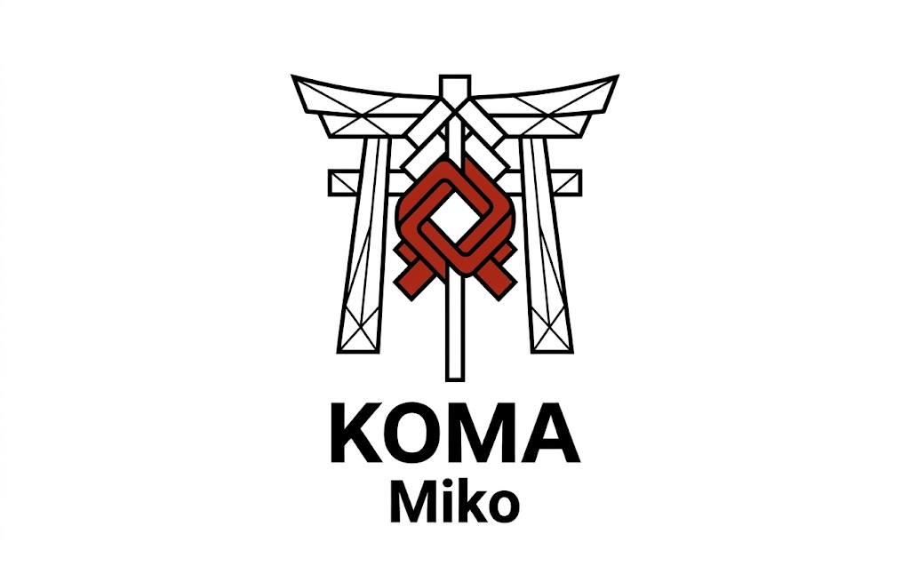

# Koma

### Verify what coding agents actually did. Protect the AI apps they build.

Koma is a TypeScript toolkit for observable AI boundaries. **Miko** checks
coding-agent Skills, tool actions, and completion evidence against local Agent
Specs. **Gate, Scout, and Core** protect prompt input, perimeter resources, and
retrieval.

```bash
npm install -D koma-miko@alpha
npx koma-miko init --host claude
```

Building an LLM endpoint instead? Start with `npm install koma-gate`.

<p align="center">
  
</p>

<p align="center">
  
  
  <a href="https://www.npmjs.com/package/koma-miko"></a>
  <a href="https://www.npmjs.com/package/koma-gate"></a>
  <a href="https://www.npmjs.com/package/koma-scout"></a>
  <a href="https://www.npmjs.com/package/koma-core"></a>
  <a href="https://www.npmjs.com/package/koma-miko-dsh"></a>
  <br />
  <a href="https://koma-demo.swbuilds.workers.dev"></a>
  
  
  <a href="https://glama.ai/mcp/servers/swnotmetal/Project-Koma"></a>
</p>

<p align="center">
  <a href="./README.zh-CN.md">中文版</a>
</p>

<p align="center">
  <strong>▶ <a href="https://koma-demo.swbuilds.workers.dev">Try Miko's guided terminal replay</a></strong> — plus Gate, Scout &amp; Core, no signup.
</p>

---

### Featured Alpha: Miko

<p align="center">
  
</p>

Coding agents can say they loaded a required Skill or ran a test. Miko does not
treat that claim as evidence. At supported local host Hooks, it compares
observed Skill loads, reference reads, tool actions, and completion checks with
a project-owned `miko.json`.

If an agent tries to edit before satisfying the spec, Miko can return a denial
and a short recovery instruction. It cannot inspect hidden model context, prove
that a model understood a Skill, or verify events the host never exposes.

```bash
npx --yes koma-miko@alpha demo       # deterministic; no API key
npx --yes koma-miko@alpha probe --host claude  # isolated adapter check; no model
npx koma-miko init --host claude     # after local installation
```

[Miko README →](./packages/koma-miko/README.md) ·
[10-second web replay →](https://koma-demo.swbuilds.workers.dev) ·
[DeepSeek Harness adapter →](./packages/koma-miko-dsh/README.md)

---

### Four Boundaries

| Boundary | Failure mode | What Koma checks | Package |
|---|---|---|---|
| Coding agent | Required Skill or completion check skipped | Host-observed preparation, action scope, and evidence | `koma-miko@alpha` |
| User → LLM | Prompt injection / jailbreak | Semantic scope before the application model | `koma-gate` |
| Request perimeter | Audio abuse / flooding | Validation, rate limits, and geo rules | `koma-scout` |
| Retrieval | Data enumeration / scraping | Split index from content; token-gate retrieval | `koma-core` |

Different attacks cross different boundaries. Koma provides a small primitive for each one.

---

### What Koma Is — and Isn't

**Is**: small composable packages · usable independently · explicit failure
modes · deterministic checks where the host exposes evidence

**Isn't**: a model · an agent framework · proof that a model understood its
instructions · a replacement for authorization · a complete security boundary
by itself

---

### Benchmarks

#### Miko alpha evaluation

Miko is deterministic, so its useful numbers are verifier cost and end-to-end
Hook behavior—not a generic score for model intelligence.

| Signal | Observed result |
|---|---|
| Offline host conformance | Claude, Codex, Gemini, and VS Code Copilot each reproduce `DENY → observed Skill → ALLOW`; ledger fixtures reject prompt/code/tool-response persistence |
| Local verifier scale | 1,000 Agent Specs: **1.34 ms p95** per action; 10,001 indexed evidence events: **0.0041 ms p95**; restore 1,000 evidence events: **1.52 ms p95** |
| Claude Code smoke | One 100-Skill / ~20k-context run passed; a separate one-Skill recovery run completed `DENY → Skill → edit` |
| DeepSeek Harness smoke | **3/3** narrow packed-artifact recovery runs passed; 19.425 s mean model phase |

The scale row is a 2026-08-27 reference run on Node 24.19 / Windows; rerun it
with `npm run eval:scale -w koma-miko`. Context tokens never enter the verifier.
The paid samples are deliberately small and **do not establish general model,
long-context, or editor reliability**. See the
[scale record](./docs/evals/miko-scale-alpha.md),
[Claude record](./docs/evals/miko-claude-haiku-alpha.md),
[host-adapter record](./docs/evals/miko-host-adapters-alpha.md), and
[DSH record](./docs/evals/miko-dsh-alpha.md).

#### Koma Gate live-model benchmark

I threw **1,769 real prompt-injection attacks** at Koma Gate in fail-closed mode, using real providers — not mock adapters.

| Provider | Recall | Precision | False Positives |
|----------|:------:|:---------:|:---:|
| DeepSeek (deepseek-chat) | **98.8%** | **100%** | **0** |
| Google (gemini-2.5-flash) | 96.2% | **100%** | **0** |

**Chinese attack set**: 100% recall · 100% precision · 0% FPR across 8 categories.

> **Can you break it?** [Open an issue](https://github.com/swnotmetal/Project-Koma/issues) with an attack Koma misses. → [Full methodology](./BENCHMARKS.md)

---

### Quick Start

```ts
import { createGeneralKnowledgeGuard } from 'koma-gate';

const guard = createGeneralKnowledgeGuard({
  llm: { apiKey: process.env.GEMINI_API_KEY },
});

app.post('/api/chat', guard.middleware(), async (req, res) => {
  // Only in-scope requests reach your model
  res.json({ reply: await chat(req.body.message) });
});
```

```bash
git clone https://github.com/swnotmetal/Project-Koma
cd Project-Koma && node demo/server.js
curl http://localhost:8080/self-test
```

---

### Application-Side Packages

**`koma-gate`** — Prompt injection firewall. LLM-based scope classifier that blocks jailbreaks, off-topic requests, and instruction overrides. Supports OpenAI, Anthropic, Google, DeepSeek, and local Ollama models. [README →](./packages/koma-gate/README.md)


**`koma-scout`** — Perimeter protection. Rate limiting, audio upload validation, geo allowlisting. Cheap checks before expensive AI work. [README →](./packages/koma-scout/README.md)


**`koma-core`** — Protected RAG storage. Public search index, private content, opaque HKDF-derived tokens. *Discovery is not authorization.* [README →](./packages/koma-core/README.md)


Each package works standalone. Stack them: Gate filters → Scout throttles → Core stores.

**MCP servers** — expose Koma to AI agents directly:

- `koma-gate-mcp` — `classify_input` tool for prompt-injection checks. [README →](./packages/koma-gate-mcp/README.md)
- `koma-core-mcp` — `search_docs` + `retrieve_doc` for protected RAG retrieval. [README →](./packages/koma-core-mcp/README.md)

```json
{
  "mcpServers": {
    "koma-gate": { "command": "npx", "args": ["-y", "koma-gate-mcp"] },
    "koma-core": { "command": "npx", "args": ["-y", "koma-core-mcp"] }
  }
}
```

---

### Using an AI coding agent?

Tell it:

> *"Add Koma to protect this AI endpoint. Use koma-gate for prompt injection, koma-scout for perimeter abuse, and koma-core for protected RAG retrieval. Each works standalone."*

For a coding-agent repository, install Miko and run
`npx koma-miko init --host claude`; then edit the generated `miko.json` to name
the Skills, paths, and completion evidence that matter to the project.

Koma is designed for both human and agent discoverability — including two [MCP servers](./packages/koma-gate-mcp/README.md). See [llms.txt](./llms.txt).

---

### Trust & Safety

- **Minimal dependency surface.** Miko, Gate, and Core have no third-party runtime dependencies; Scout declares Express as a peer.
- **No model-output execution.** Miko observes host events; Gate, Scout, and Core classify, rate-limit, or store. None executes generated code.
- **Fail-open by default.** A broken optional guard does not take down the app; security-first deployments can set `failOpen: false`.
- **CodeQL on every push.** Targets OWASP LLM01.
- **MIT licensed.**

→ [Security policy](./SECURITY.md) · [Known limitations](./SECURITY-HARDENING.md) · [Comparison with alternatives](./COMPARISON.md) · [Contributing](./CONTRIBUTING.md)

---

Koma comes from Komainu ("狛犬"), the stone guardian lions of Japanese Shinto shrines. Three deployed defense layers, each standalone, plus the Miko alpha agent-contract boundary. Patterns distilled from production, not papers.

[License](./LICENSE)
