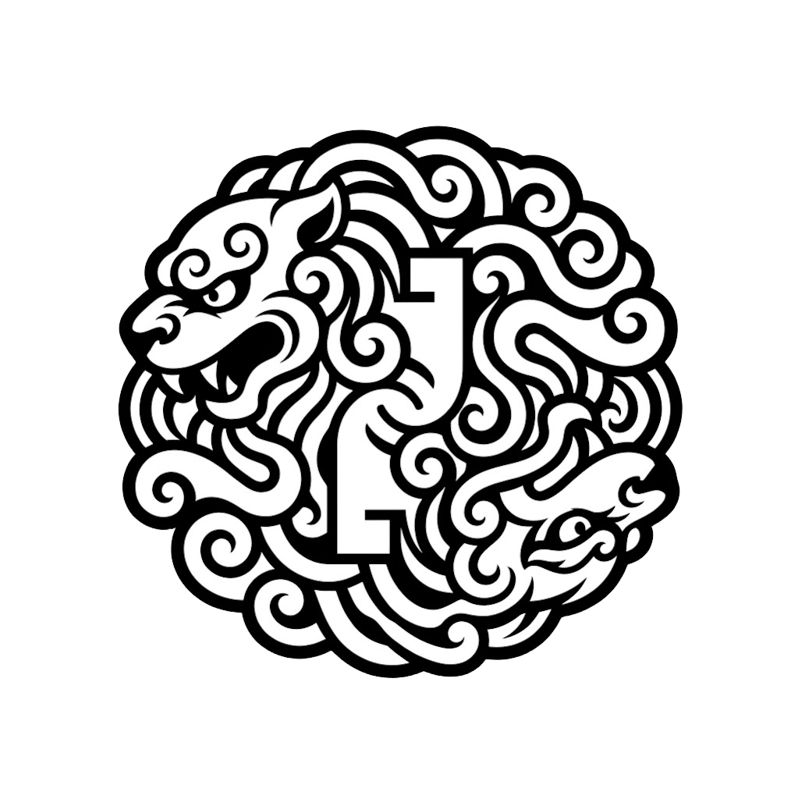
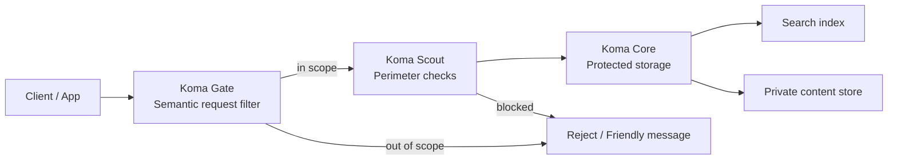

# Koma

Open-source AI guardrails, anti-bot throttling, and zero-trust storage for AI apps.

<p align="center">
  
</p>

<p align="center">
  
  
  
</p>

<p align="center">
  <a href="./README.md">English</a> · <a href="./README.zh-CN.md">中文导览</a>
</p>

Koma is a modular defensive toolkit for AI apps. Each skill stands alone, so the stack can be adopted in layers.

Its patterns were distilled from a production voice-AI medication-information system.
The repo contains the reusable defense layers only — no domain-specific data or proprietary prompts.

AI guardrails, rate limiting, prompt filtering, upload validation, and protected retrieval are covered in a format that stays readable at a glance.

<p align="center">
  
</p>

## AI Agent Quick Read

- Read order: this README, then [demo/server.js](demo/server.js), then the package README for the target layer.
- Koma Gate filters scope before model or tool calls.
- Koma Scout enforces perimeter checks before expensive processing.
- Koma Core separates public index data from private content data.
- The demo GIF shows all three layers in one flow.

## At a Glance

<table>
  <tr>
    <td width="33%">
      <strong>1. Koma Gate</strong><br />
      Semantic request filtering and scope control.<br />
      <code>koma-gate</code>
    </td>
    <td width="33%">
      <strong>2. Koma Scout</strong><br />
      Traffic gating, upload checks, and anti-bot throttling.<br />
      <code>koma-scout</code>
    </td>
    <td width="33%">
      <strong>3. Koma Core</strong><br />
      Zero-trust index/content separation for protected data.<br />
      <code>koma-core</code>
    </td>
  </tr>
</table>

The storage layer inside `koma-core` ships with two operating modes:

<table>
  <tr>
    <td width="50%">
      <strong>Core Lite</strong><br />
      Minimal split-store pattern for beginners.
    </td>
    <td width="50%">
      <strong>Core Strict</strong><br />
      Hardened split-store pattern with tiers, audit, and token-limited retrieval.
    </td>
  </tr>
</table>

## Why It Stands Out

- One repository, three clear skills.
- Each module has a single job.
- `koma-gate` ships with 4 battle-tested presets (general, code, support, reference tool).
- The storage layer is split into a beginner mode and a strict mode.
- Patterns were distilled from a real production voice-AI system, not invented in isolation.
- The homepage is optimized for fast scanning on GitHub.
- See [COMPARISON.md](COMPARISON.md) for a detailed comparison with Guardrails AI, NeMo, LLM Guard, and custom middleware.
- The repo includes a clean-install smoke test so npm usability is not guesswork.

## Architecture



### Defense Layers

1. Koma Gate filters scope and blocks obvious abuse.
2. Koma Scout adds rate limiting, upload checks, and geo controls.
3. Koma Core separates searchable records from protected content.

## Repository Layout

- `packages/koma-gate/README.md`
- `packages/koma-scout/README.md`
- `packages/koma-core/README.md`
- `README.zh-CN.md`
- `VERSIONING.md`
- `CHANGELOG.md`
- `LICENSE`
- `package.json`
- `demo/server.js`
- `packages/` - implementation source for the current codebase

## Quick Start

Run the local demo with stock Node.js:

```bash
node demo/server.js
```

Then try:

- `GET /health`
- `POST /guard`
- `POST /scout`
- `POST /ingest`
- `GET /search?q=example`
- `GET /content?token=...`
- `GET /self-test`

Example guard request:

```bash
curl.exe -X POST http://localhost:8080/guard \
  -H "Content-Type: application/json" \
  -d "{\"text\":\"How to build rate limiting middleware in Node?\"}"
```

Use `curl.exe` instead of `curl` on Windows — `curl` is a PowerShell alias for `Invoke-WebRequest`.

PowerShell-safe variant:

```powershell
@'
{"text":"How to build rate limiting middleware in Node?"}
'@ | curl.exe -X POST http://localhost:8080/guard -H "Content-Type: application/json" --data-binary '@-'
```

Example self-test:

```bash
curl http://localhost:8080/self-test
```

## Demo

<p align="center">
  
</p>

The GIF above shows Gate, Scout, and Core in one flow. Run it locally:

```bash
node demo/server.js
curl http://localhost:8080/self-test
```

### What the Scout result means

A Scout response like this:

```json
{
  "success": false,
  "layer": "scout",
  "checks": {
    "size": false,
    "duration": false,
    "mime": true,
    "country": true
  }
}
```

means the request was blocked before any model call. The file was too small or too short to be worth processing. The perimeter layer did its job — the expensive layer never woke up.

The tape for re-recording is at [docs/koma-demo.tape](docs/koma-demo.tape). Use WSL2 or a POSIX shell for the cleanest result.

## Package Overview

### Koma Gate

Returns a strict JSON decision and blocks off-scope traffic before it reaches the model or tools.

### Koma Scout

Handles request throttling, upload validation, and cheap perimeter checks before expensive work begins.

### Koma Core

Separates public search records from private content payloads and links them with backend-derived opaque tokens.

## Project Conventions

- Source code is English-first.
- APIs are production-oriented; docs are written for both humans and AI agents.
- The demo server is dependency-free and includes a built-in self-test.
- Each package is designed to be published independently.
- Release and tag rules live in [VERSIONING.md](VERSIONING.md).
- Gate presets, Scout thresholds, and Core patterns were derived from defenses that blocked real prompt-injection, silence-hallucination, and data-exfiltration attempts in a live voice-AI system.

## Verifying npm Locally

To test the package in a clean directory before or after publishing, use the repo's smoke test. This answers “will it work in a fresh folder?”

```bash
npm run smoke:npm
```

Or do it manually with a fresh folder:

```bash
npm pack packages/koma-gate
mkdir C:\temp\koma-test
cd C:\temp\koma-test
npm init -y
npm install D:\path\to\koma-gate-0.1.0.tgz
node --input-type=module -e "import { createGeneralKnowledgeGuard } from 'koma-gate'; console.log(typeof createGeneralKnowledgeGuard)"
```

The smoke test does three things automatically:

1. Packs each workspace package.
2. Installs the tarball into a temporary empty directory.
3. Imports the public exports to confirm the package actually works.

## Cross-Platform Testing

Command style depends on the shell:

| System | API test command style | Details |
| --- | --- | --- |
| Windows PowerShell | `curl.exe` + `--data-binary '@-'` or `Invoke-RestMethod` | Bare `curl` is a PowerShell alias. Use here-strings or `Invoke-RestMethod` for JSON bodies. |
| macOS / Linux | `curl` with single-quoted JSON | VHS tape runs natively in this environment. |
| Windows WSL2 | `curl` (POSIX style) | Best option for running VHS on Windows. |

Example PowerShell-friendly request:

```powershell
@'
{"sizeBytes":16000,"durationMs":2000,"mimeType":"audio/mp4","country":"US"}
'@ | curl.exe -X POST http://localhost:8080/scout -H "Content-Type: application/json" --data-binary '@-'
```

## Bilingual Guide

- English: [README.md](README.md)
- 中文导览: [README.zh-CN.md](README.zh-CN.md)

## One-Click Demo

Koma is currently source-first and npm-first. A browser-only demo can be added later with StackBlitz or CodeSandbox for a fully online walkthrough.

## Contributing

Contributions should stay:

- English-first in source
- concise and professional in docs
- modular and beginner-friendly
- focused on defensive use cases

## License

Koma is released under the MIT License. See [LICENSE](LICENSE).
