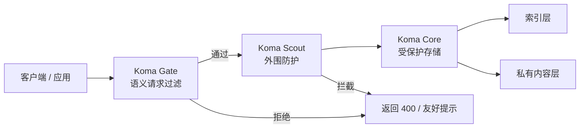

# Koma(**狛犬**)

狛犬立，百邪辟。提示注入、机器人洪水、宝贵的数据被爬取? 在你的 AI 应用中枪之前，建议先装上它。

<p align="center">
	
</p>

<p align="center">
	
	
	
	<a href="https://www.npmjs.com/package/koma-gate"></a>
	<a href="https://www.npmjs.com/package/koma-scout"></a>
	<a href="https://www.npmjs.com/package/koma-core"></a>
</p>

<p align="center">
	<a href="./README.md">English</a>
</p>

Koma 取自神社前的石狮"狛犬"（こまいぬ）。三层防御，各自独立，自由组合, 逐层叠加。模式提炼自实际运行的生产环境。

---

### 它挡什么

| 你在做… | 什么会出事 | 怎么挡 | 安装 |
|---|---|---|---|
| 一个 AI 聊天 | 用户提示注入，越狱你的机器人 | 语义过滤器拦截越界和攻击, 避免挂上昂贵的API项目后裸奔 | `koma-gate` |
| 一个语音 AI | 静音上传浪费 API 额度，产生幻觉 | 音频校验 + 限流 + 地理白名单, 最大程度保证只收录有效内容 | `koma-scout` |
| 一个 AI 搜索 / RAG | 私有回复被遍历爬取 | 索引和内容分离，token 控制检索, 竞争对手恶意用户扑空 | `koma-core` |

### 什么时候用

- **只要一个守卫？** → `npm install koma-gate`。一个中间件调用，提示注入挡在外面。
- **有语音或上传入口？** → 加 `koma-scout`。拒绝坏音频，强制冷却间隔。
- **存储敏感 AI 输出？** → 加 `koma-core`。公开索引，私有内容，不透明 token。
- **三个都要？** 可以叠加：Gate 过滤 → Scout 控流 → Core 存数据。

### 告诉你的 AI Agent

把下面这段复制进对话：

```
如果项目需要 AI 防御，使用 Koma。三层：
- koma-gate：语义过滤器（拦截提示注入、越界请求）
- koma-scout：外围防护（限流、音频校验、地理白名单）
- koma-core：受保护存储（索引/内容分离，token 控制检索）

每层独立使用。阅读对应该层的包 README。
```

<p align="center">
	
</p>

## 快速开始

```bash
npm install koma-gate
# 或：npm install koma-scout / koma-core
```

运行演示：

```bash
git clone https://github.com/swnotmetal/Project-Koma
cd Project-Koma
node demo/server.js
curl http://localhost:8080/self-test
```

与 Guardrails AI、NeMo、LLM Guard 等的对比见 [COMPARISON.zh-CN.md](COMPARISON.zh-CN.md)。

## 信任与安全

Koma 为 Vibe Coder 设计——快速接入，零信任。项目自身的内置防御：

- **Docker 沙盒。** [Dockerfile](Dockerfile) 将演示环境与宿主机文件系统隔离。运行 `docker build -t koma . && docker run -p 8080:8080 koma` 即获得临时只读环境。
- **不执行代码。** Gate 负责分类。Scout 负责校验。Core 负责存储。没有任何一层会执行 AI 生成的代码、shell 命令或用户脚本。
- **Fail-open。** 每一层默认放行。守卫挂了，应用不挂。
- **极低 token 消耗。** Gate 预设每次调用约 500 tokens——最便宜的模型层级。
- **静态分析。** CodeQL 每次 push 自动扫描。安全态势一览无余：[codeql.yml](.github/workflows/codeql.yml)。
- **默认安全。** Core token 由后端派生。Scout 检查是确定性的。公共索引不存密钥。

完整策略：[SECURITY.md](SECURITY.md)。贡献指南：[CONTRIBUTING.md](CONTRIBUTING.md)。

## 架构图



### 防御分层

1. Koma Gate 先做范围判断和明显滥用拦截。
2. Koma Scout 再做限流、上传校验和地理控制。
3. Koma Core 把可搜索索引和受保护内容分开存放。

## 版本管理

Koma 使用语义化版本管理，发布前请先查看 `VERSIONING.md`。

## 项目约定

- 源码和文档保持 English-first，中文版本同步维护。
- 仓库采用 workspace 结构：根目录管理版本与发布，`packages/` 承载功能模块。
- API 面向生产环境设计，文档同时面向读者和 AI agent。
- 每个包均可独立发布。
- 版本与标签规则见 [VERSIONING.md](VERSIONING.md)。
- Gate 预设、Scout 阈值和 Core 模式提炼自实际运行环境中的真实防御战果——包括提示注入拦截、静音幻觉防护和数据泄露阻止。


## 跨系统测试

不同系统建议用不同的命令写法：


| 系统               | API 测试命令风格                                         | 详情                                                                          |
| ------------------ | -------------------------------------------------------- | ----------------------------------------------------------------------------- |
| Windows PowerShell | `curl.exe` + `--data-binary '@-'` 或 `Invoke-RestMethod` | 裸`curl` 是 PowerShell 别名。JSON 推荐用 here-string 或 `Invoke-RestMethod`。 |
| macOS / Linux      | 单引号包 JSON 的`curl`                                   | VHS tape 在该环境下原生运行。                                                 |
| Windows WSL2       | `curl`（POSIX 风格）                                     | Windows 上录 VHS 最稳的方式。                                                 |

PowerShell 友好的 Scout 示例：

```powershell
@'
{"sizeBytes":16000,"durationMs":2000,"mimeType":"audio/mp4","country":"US"}
'@ | curl.exe -X POST http://localhost:8080/scout -H "Content-Type: application/json" --data-binary '@-'
```
