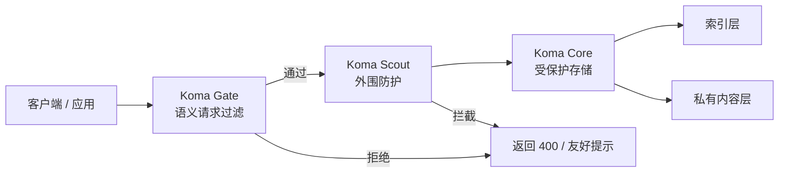

# Koma

面向 AI 应用的开源防御能力集合：语义过滤、反机器人控制、零信任存储。

<p align="center">
	
</p>

<p align="center">
	
	
	
</p>

<p align="center">
	<a href="./README.md">English</a> · <a href="./README.zh-CN.md">中文导览</a>
</p>

Koma 是一个面向 AI 应用的模块化防御工具箱。每个技能都可以单独采用，先解决最需要的那一层，再逐步叠加防护。

这套模式是从一个实际运行的生产环境语音 AI 药物信息系统里蒸馏出来的。
仓库只包含可复用的防御层——没有领域数据、没有私有提示词。

如果关注 AI guardrails、限流、提示词过滤、上传校验或受保护的检索，这个仓库适合用来快速读懂、快速验证、快速集成。

<p align="center">
	
</p>

## AI Agent 快速阅读

- 阅读顺序：本页 README、[demo/server.js](demo/server.js)、目标模块的中文 README。
- Koma Gate 负责在模型和工具调用之前做范围过滤。
- Koma Scout 负责在昂贵处理之前做外围防护。
- Koma Core 负责把索引数据和私有内容数据分离。
- 这张 GIF 展示了三层防护的完整流程。

## 一览

<table>
	<tr>
		<td width="33%">
			<strong>1. Koma Gate</strong><br />
			语义请求过滤与范围控制。<br />
			<code>koma-gate</code>
		</td>
		<td width="33%">
			<strong>2. Koma Scout</strong><br />
			流量控制、上传检查与反机器人策略。<br />
			<code>koma-scout</code>
		</td>
		<td width="33%">
			<strong>3. Koma Core</strong><br />
			面向敏感数据的零信任索引/内容分离。<br />
			<code>koma-core</code>
		</td>
	</tr>
</table>

`koma-core` 的存储层还分成两个模式：

<table>
	<tr>
		<td width="50%">
			<strong>Core Lite</strong><br />
			适合入门的最小 split-store 模式。
		</td>
		<td width="50%">
			<strong>Core Strict</strong><br />
			带分级、审计和限次读取的强化模式。
		</td>
	</tr>
</table>

## 为什么更容易看懂

- 一个仓库，三个清晰职责。
- 每个模块只做一件事。
- 存储层区分入门模式和严格模式。
- GitHub 首页可以直接读懂，不需要额外说明。
- 与 Guardrails AI、NeMo、LLM Guard 等的详细对比见 [COMPARISON.md](COMPARISON.md)。
- 另外还提供了清洁目录的 npm 验证，避免"看起来能用但其实装不上"的情况。

## 架构图



### 防御分层

1. Koma Gate 先做范围判断和明显滥用拦截。
2. Koma Scout 再做限流、上传校验和地理控制。
3. Koma Core 把可搜索索引和受保护内容分开存放。

## 目录结构

- `packages/koma-gate/README.md`
- `packages/koma-scout/README.md`
- `packages/koma-core/README.md`
- `package.json`
- `VERSIONING.md`

## 如何切换中文版本

- 英文版：[README.md](README.md)
- 中文导览：[README.zh-CN.md](README.zh-CN.md)

## 演示

<p align="center">
	
</p>

上面的 GIF 展示了 Gate、Scout、Core 三层的一次完整流程。本地运行：

```bash
node demo/server.js
curl http://localhost:8080/self-test
```

### Scout 结果到底是什么意思

下面这样的结果表示：

```json
{
	"success": false,
	"layer": "scout",
	"checks": {
		"size": false,
		"duration": false,
		"mime": true,
		"country": true
	}
}
```

意思是请求在进入模型之前就被拦下了。文件太小或时长太短，不值得浪费模型和存储资源。边缘防护已经完成了任务，昂贵的一层根本没必要启动。这就是 Koma 的真实价值：少花 API 费，少收垃圾请求，少让系统背负无意义工作。

录制剧本在 [docs/koma-demo.tape](docs/koma-demo.tape)。建议在 WSL2 或 POSIX shell 中运行。

## 版本管理

Koma 使用语义化版本管理，发布前请先查看 `VERSIONING.md`。

## 项目约定

- 源码和文档保持 English-first，中文版本同步维护。
- 仓库采用 workspace 结构：根目录管理版本与发布，`packages/` 承载功能模块。
- API 面向生产环境设计，文档同时面向人类读者和 AI agent。
- 每个包均可独立发布。
- 版本与标签规则见 [VERSIONING.md](VERSIONING.md)。
- Gate 预设、Scout 阈值和 Core 模式提炼自实际运行环境中的真实防御战果——包括提示注入拦截、静音幻觉防护和数据泄露阻止。

## npm 验证

如果要确认“新目录里下载安装到底能不能用”，请直接运行：

```bash
npm run smoke:npm
```

这个脚本会自动：

1. 给每个包打 tarball。
2. 在临时空目录里安装 tarball。
3. `import` 导出，确认包真的可用。

## 跨系统测试

不同系统建议用不同的命令写法：

| 系统 | API 测试命令风格 | 详情 |
| --- | --- | --- |
| Windows PowerShell | `curl.exe` + `--data-binary '@-'` 或 `Invoke-RestMethod` | 裸 `curl` 是 PowerShell 别名。JSON 推荐用 here-string 或 `Invoke-RestMethod`。 |
| macOS / Linux | 单引号包 JSON 的 `curl` | VHS tape 在该环境下原生运行。 |
| Windows WSL2 | `curl`（POSIX 风格） | Windows 上录 VHS 最稳的方式。 |

PowerShell 友好的 Scout 示例：

```powershell
@'
{"sizeBytes":16000,"durationMs":2000,"mimeType":"audio/mp4","country":"US"}
'@ | curl.exe -X POST http://localhost:8080/scout -H "Content-Type: application/json" --data-binary '@-'
```

